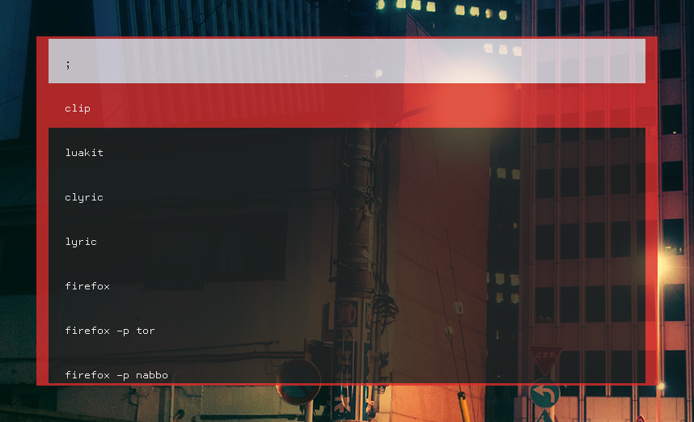

# MyMenu

> A replacement for dmenu, 'cause I was bored




---

## What?

This is a replacement for `dmenu(1)`.

## Why?

This was the perfect excuse to learn how to make window with Xlib.

## How?

Check out the [manpage](mymenu.1) for further documentation. Check out
also the [template](Xexample) for the resources.

---

## Dependencies

 - Xlib
 - Xinerama (optional)
   For multi-monitor support
 - pkg-config (optional)
   used in the makefile to generate `LIBS` and `CFLAGS` correctly

## Build

As simple as `make`. If you want to disable Xinerama support just
delete `-DUSE_XINERAMA` from the `CFLAGS` and `xinerama` from the
`pkg-config` call from the Makefile.

---

## TODO

 - Command line flags
 
   At the moment the X Resource Database is the only way to interact
   with the graphic appearance of MyMenu.

 - Optional TrueType support
 
 - Opacity support

## Scripts

I'm using this script to launch MyMenu with custom item

``` shell
#!/bin/sh

cat <<EOF | /bin/sh -c "$(mymenu "$@")"
sct 4500
lock
connect ethernet
connect home
connect phone
ZZZ
zzz
...
EOF
```

You can generate a menu from the `.desktop` file with something like
this:

``` shell
#!/bin/sh

getname() {
    cat $1 | grep '^Name=' | sed 's/^.*=//'
}

getexec() {
    cat $1 | grep '^Exec=' | sed 's/^.*=//'
}

desktop_files=`ls /usr/local/share/applications/*.desktop`

{
    for i in $desktop_files; do
        getname $i
    done
} | mymenu "$@" | {
    read prgname
    for i in $desktop_files; do
        name=`getname $i`
        if [ "x$prgname" = "x$name" ]; then
            exec `getexec $i`
        fi
    done
}
```

or generate a list of executables from `$PATH` like this:

``` shell
#!/bin/sh

path=`echo $PATH | sed 's/:/ /g'`

{
    for i in $path; do
        ls -F $i | grep '.*\*$' | sed 's/\*//'
    done
} | sort | /bin/sh -c "$(mymenu "$@")"
```

Of course you can as well use the `dmenu_path` and `dmenu_run` scripts
that (usually) comes with `dmenu`.
